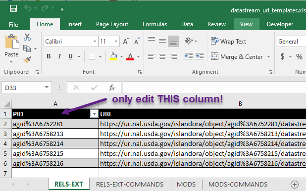
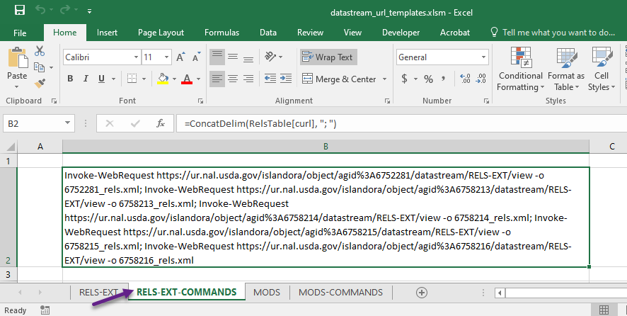
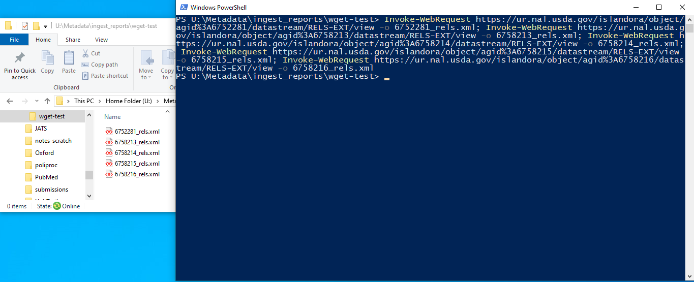

## Tools to make QCing metadata easier
### get_statuses.xsl
For a given list of RELS-EXT files, create a new XML file containing the PID, ISSN, and Article Status. The resulting file can be opened in Excel to easily view the status of the articles.

Expects an XML file-list formatted like the below:

``` xml
<?xml version="1.0" encoding="UTF-8"?>
<fileList>
    <file>file:///path/to/file.xml</file>
</fileList>    
```

### getSubmissionInfo.xsl
Takes a file list like **get_statuses** for submissions MODS files and returns an XML file that can be opened in Excel for quick review.

## combineCrossRefs.xsl
This stylesheet works very similarly to the one that gets information about submissions. It combines the output of DOIMODS_to_CrossRef.xsl into a single file for obtaining DOIs.

### datastream_url_templates.xlsm
Macro-enabled template to generate a list of commands for bulk downloading MODS and RELS-EXT datastreams. _Make sure macros are enabled or it will not work._

This file has six worksheets: RELS-EXT, RELS-EXT-COMMANDS, MODS, MODS-COMMANDS, SOURCE, and SOURCE_COMMANDS. The only sheets you will be editing are RELS-EXT, MODS, and SOURCE. 

Open the sheet for the datastream you want to download, in this case RELS-EXT.
Paste your list of PIDS into the **PID** column. _**this is the only column you will be editing. Do not add or remove content anywhere else.**_ Make sure the colon (**:**) is replaced with **%3A**.




Once you have added your PIDS, switch to the commands tab for the datastreams you want to download; in this case RELS-EXT-COMMANDS.



Copy the content from cell B2 and paste it into a text file. Remove any linebreaks from the end of the command and then copy it again.

Open a Powershell window in the folder you want to save the datastreams to. Paste the command (_with linebreaks removed!_) and hit enter. Your files will be downloaded!


